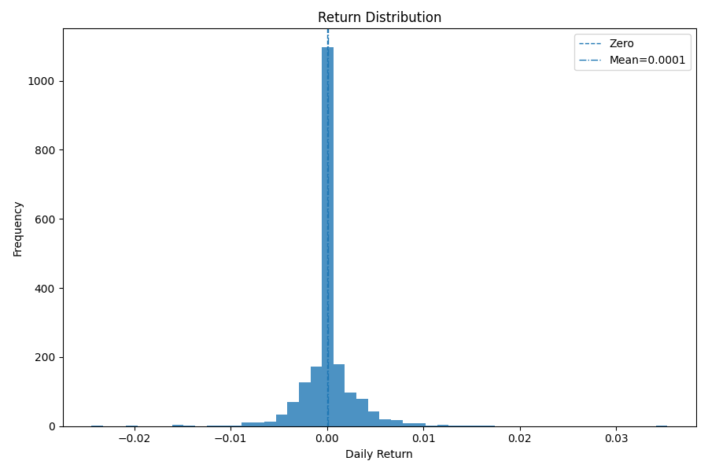

# Pairs Trading Research Framework


A compact, end-to-end workflow for statistical pairs trading.  
Includes data acquisition, pair selection, signal generation, vectorized backtesting, performance analytics, and publication-ready figures.


---

## Features
- **Data pipeline**
  - Yahoo Finance via `yfinance` (Adjusted Close, Volume)
  - Cleans and aligns prices to a wide matrix
- **Pair selection**
  - OLS hedge ratio + Engle–Granger cointegration
  - ADF test on residuals
  - Half-life estimation (AR(1) on the spread)
  - Optional same-sector filter and return-correlation prefilter
- **Strategy**
  - Spread construction, rolling z-score
  - Band logic with configurable entry/exit, optional z-stop and time stop
- **Backtesting**
  - Vectorized, next-close execution with linear fees + slippage
  - Equity curve, drawdowns, exposures, turnover, summary metrics
- **Visualization**
  - Spread with signals and z-score overlay
  - Equity + drawdown with concise date formatting

---

## Quickstart

Clone the repository:

```bash
git clone https://github.com/<your-username>/pairs-trading.git
cd pairs-trading
```

Create and activate a virtual environment:

```bash
python -m venv .venv
# macOS/Linux:
source .venv/bin/activate
# Windows (PowerShell):
.venv\Scripts\Activate.ps1
```

Install dependencies:

```bash
pip install -r requirements.txt
```

Run the main workflow:

```bash
python main.py
```

---

## Example Results

Running `main.py` produces:

- Console summary with top-ranked pairs and metrics (CAGR, Sharpe, Sortino, max drawdown, annual turnover).
- Figures saved to `results/figures/`:
  - `XLP_XLY_spread_signals.png`
  - `XLP_XLY_equity_drawdown.png`

### Sample Figures





---

## Project Structure

```
pairs-trading/
  main.py             # entry point script
  data.py             # download, align, validate, save
  pairs.py            # correlation, cointegration, half-life, ranking
  strategy.py         # hedge ratio, spread, z-score, signal engine
  backtest.py         # vectorized backtest + metrics
  viz.py              # plots and visualizations
  requirements.txt    # Python dependencies
  pyproject.toml      # package metadata
  README.md
  results/
    figures/          # saved plots
  data/
    raw/              # raw price data
    processed/        # cleaned wide matrix
  outputs/
    csv/              # CSV outputs
  tests/              # (optional) pytest unit tests
```

---

## Configuration

Key parameters can be adjusted in `main.py`:

```python
TICKERS = ("XLP", "XLY", "XLV", "XLI")
START_DATE = "2018-01-01"
END_DATE   = "2025-01-01"

ZSCORE_WINDOW   = 60
Z_ENTRY, Z_EXIT = 2.0, 0.5
Z_STOP          = 3.0
TIME_STOP_BARS  = 20

FEE_BPS, SLIPPAGE_BPS = 1.0, 1.0
START_CAPITAL = 100_000.0
DOLLAR_PER_LEG = 50_000.0
```

---

## Requirements
- Python 3.10+  
- Libraries: pandas, numpy, statsmodels, matplotlib, yfinance, pyarrow  
  (see `requirements.txt` for full list)

---

## Notes & Disclaimer
This repository is for **educational and research purposes only**.  
It is not investment advice and does not constitute a recommendation to buy or sell any security.

---

## License
[MIT](LICENSE)

---

## Acknowledgments
- [yfinance](https://github.com/ranaroussi/yfinance) for market data
- [statsmodels](https://www.statsmodels.org/) for econometric tools
- [pandas](https://pandas.pydata.org/), [numpy](https://numpy.org/), [matplotlib](https://matplotlib.org/) for the core stack
