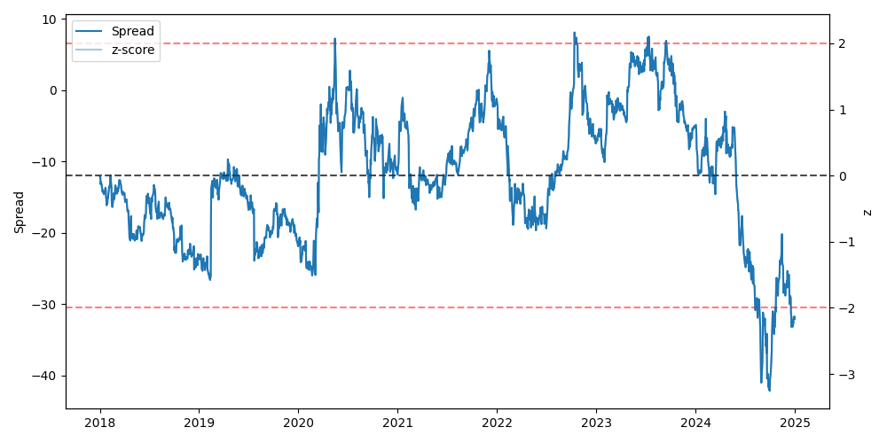

# Pairs Trading Research Framework


An end-to-end Python framework for exploring statistical arbitrage with pairs trading.  
The project demonstrates skills in **data collection, cleaning, time series analysis, backtesting, and visualization**.

---

## Features
- **Data handling**
  - Pulls daily stock prices with `yfinance`
  - Cleans and aligns data into a single table for analysis
- **Pair selection**
  - Finds stock pairs that move together
  - Basic filters to avoid random or unrelated matches
- **Strategy**
  - Builds a spread between two stocks
  - Calculates a rolling z-score to detect when the spread is “too wide” or “too tight”
  - Entry/exit rules based on simple thresholds
- **Backtesting**
  - Simulates trades on historical data
  - Tracks profit/loss, portfolio value, and drawdowns
  - Reports core metrics: growth, volatility, Sharpe ratio, hit rate
- **Visualization**
  - Plot of the spread with entry/exit signals
  - Equity curve with drawdown shading

---

## Quickstart

Clone the repository:

```bash
git clone https://github.com/<your-username>/pairs-trading.git
cd pairs-trading
```

Create and activate a virtual environment:

```bash
python -m venv .venv
# macOS/Linux:
source .venv/bin/activate
# Windows (PowerShell):
.venv\Scripts\Activate.ps1
```

Install dependencies:

```bash
pip install -r requirements.txt
```

Run the main workflow:

```bash
python3 main.py
```

---

## Example Results

Running `main.py` produces:

- **Console summary**:
  - Selected stock pair and hedge ratio
  - Table of top candidate pairs
  - Starting capital vs. ending equity
  - Performance metrics (growth rate, Sharpe ratio, max drawdown, hit rate)
- **Figures** saved to `results/figures/`:
  - Spread with entry/exit markers
  - Equity curve with drawdowns

### Sample Figures

  


---

## Project Structure

```
pairs-trading/
  README.md
  LICENSE
  requirements.txt
  main.py                  # entry-point script
  src/                     # source code
    data.py                # download, clean, validate prices
    pairs.py               # find and rank candidate pairs
    strategy.py            # spread, z-score, signal generation
    backtest.py            # backtesting + metrics
    viz.py                 # plotting utilities
  data/
    raw/                   # raw price data (ignored)
    processed/             # cleaned data (ignored)
  results/
    figures/               # output plots
  tests/                   # pytest unit tests
```

---

## Configuration

Key parameters in `main.py`:

```python
TICKERS = ("KO", "PEP")
START_DATE = "2018-01-01"
END_DATE   = "2025-01-01"

ZSCORE_WINDOW   = 60
Z_ENTRY, Z_EXIT = 2.0, 0.5
Z_STOP          = 3.0
TIME_STOP_BARS  = 20

FEE_BPS, SLIPPAGE_BPS = 1.0, 1.0
START_CAPITAL = 100_000.0
DOLLAR_PER_LEG = 50_000.0
```

---

## Requirements
- Python 3.10+  
- Libraries: pandas, numpy, statsmodels, matplotlib, yfinance, pyarrow  
  (see `requirements.txt` for full list)

---

## Notes & Disclaimer
This project is for **educational purposes only** and should not be used as financial advice.

---

## License
[MIT](LICENSE)

## Acknowledgments
- [yfinance](https://github.com/ranaroussi/yfinance) for market data
- [statsmodels](https://www.statsmodels.org/) for econometric tools
- [pandas](https://pandas.pydata.org/), [numpy](https://numpy.org/), [matplotlib](https://matplotlib.org/) for the core stack
